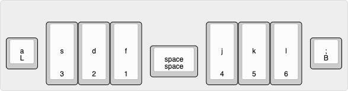

> Plover plugin for Braille writing

A plugin allowing writing of Braille with plover, directly translating Braille input to english.
This system is based on Unified English Braille (UEB), with specification from [The Rules of Unified English Braille](http://www.iceb.org/Rules%20of%20Unified%20English%20Braille%202013.pdf).

To use this system, you will need to:
- install `plover-dict-commands` - this can be easily done from the plover plugin manager 
- load all 5 dictionaries from the dictionaries/ directory in the following order, with the corresponding active state:
	- `[ ]` numbers.json
	- `[ ]` grade1-passage.json
	- `[ ]` grade1.json
	- `[ ]` caps.json
	- `[x]` braille.py

If the state of the dictionaries goes wrong and you need to reset them to the correct order and active state, press: `BLS` (backspace, newline and space)
To toggle plover on and off you can also press `BL` (backspace, newline)

Due to a current limitation and [hard-coded value in plover](https://github.com/openstenoproject/plover/blob/6c5167f48476a499f2a0dbb973f6b77123bde429/plover/steno.py#L21) using numbers 1 to 6 for the cells lead to issues and inconsistencies with the dictionary.
To eliviate this issue, the references for the dots inside each cell line up with the qwerty keymap for the layout.

| cell    | layout  |
| ------- | ------- |
| `1 : f` | `4 : j` |
| `2 : d` | `5 : k` | 
| `3 : s` | `6 : l` | 

Made with testing and braille support from: @a-lint, thanks!
